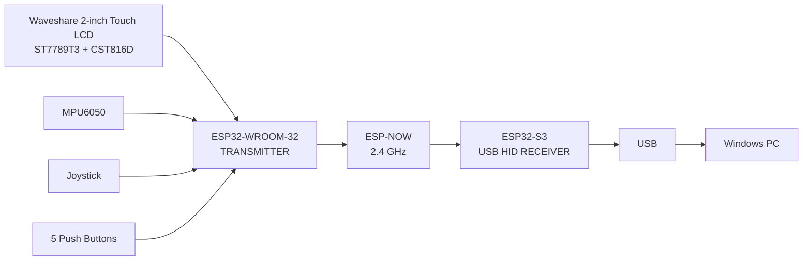
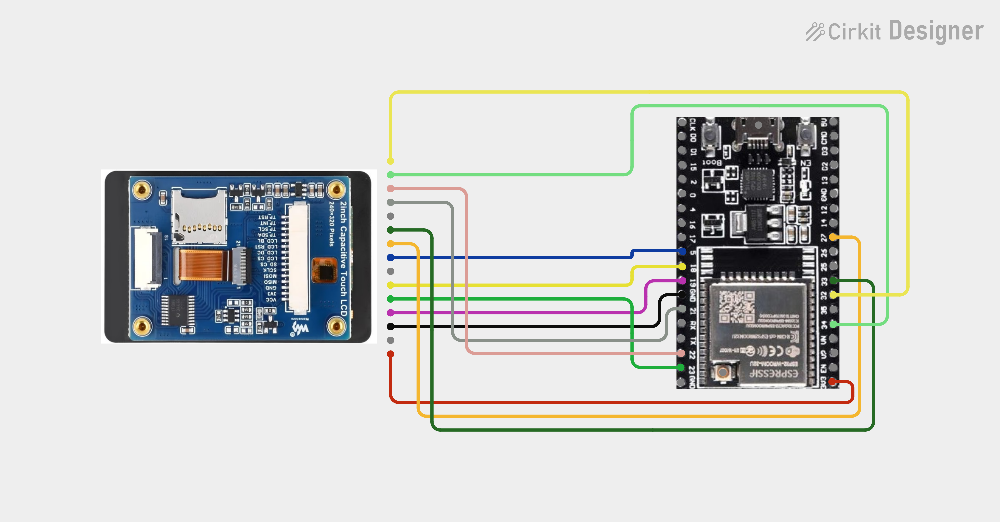

# Smart Wireless Touchpad & Air Mouse for Windows PC using Dual ESP32

A dual-ESP32 wireless controller that combines a touch display, motion sensing, joystick and physical controls on a handheld ESP32-WROOM-32 transmitter, then presents the received controls to a Windows PC through an ESP32-S3 USB HID receiver.

## Project status

> **Important source note:** The two `.ino` files supplied with the project were inspected. The uploaded file named `ESP32-S3 USB Receiver.ino` contains the same WROOM-32 transmitter sketch as the uploaded `ESP32-WROOM-32 Controller.ino`. The repository therefore preserves that upload unchanged under `firmware/uploaded-source/` and separately documents the intended S3 receiver role. Do not flash the uploaded S3 file to an ESP32-S3 as receiver firmware unless it has been replaced with the actual receiver sketch.

## System overview



## Circuit diagrams

### Main circuit schematic


### Circuit wiring & modules


## Repository map

```text
Smart-Wireless-Touchpad-Air-Mouse/
├── README.md
├── LICENSE
├── .gitignore
├── circuit_image -main.png
├── circuit_image.png
├── docs/
│   ├── ARDUINO_IDE_SETUP.md
│   ├── WIRING.md
│   ├── BUILD_AND_FLASH.md
│   ├── ARCHITECTURE.md
│   ├── CONTROLS.md
│   ├── ESP_NOW_PROTOCOL.md
│   ├── TROUBLESHOOTING.md
│   ├── TEST_PLAN.md
│   └── TEAM_GUIDE.md
├── firmware/
│   ├── ESP32-WROOM-32-Controller/
│   │   └── ESP32-WROOM-32-Controller.ino
│   ├── ESP32-S3-USB-Receiver/
│   │   └── ESP32-S3-USB-Receiver.uploaded.ino
│   └── uploaded-source/
│       ├── ESP32-WROOM-32 Controller.ino
│       └── ESP32-S3 USB Receiver.ino
└── hardware/
    └── CONNECTION_CHECKLIST.md
```

## Quick start

1. Install Arduino IDE 2.
2. Install the Espressif `esp32` board package.
3. Install the required libraries listed in [`docs/ARDUINO_IDE_SETUP.md`](docs/ARDUINO_IDE_SETUP.md).
4. Build the transmitter first using [`firmware/ESP32-WROOM-32-Controller/ESP32-WROOM-32-Controller.ino`](firmware/ESP32-WROOM-32-Controller/ESP32-WROOM-32-Controller.ino).
5. Wire the transmitter exactly as described in [`docs/WIRING.md`](docs/WIRING.md).
6. Verify the transmitter serial output and sensor detection.
7. Program the ESP32-S3 with the **actual receiver sketch**. The currently uploaded file in `firmware/ESP32-S3-USB-Receiver/` is preserved for traceability and is not receiver firmware.
8. Test the complete chain using [`docs/TEST_PLAN.md`](docs/TEST_PLAN.md).

## Core hardware

### Transmitter

- ESP32-WROOM-32 development board
- Waveshare 2-inch Capacitive Touch LCD, 240×320, ST7789T3 + CST816D
- MPU6050
- SSD1306 128×64 I2C OLED
- 2-axis analog joystick with push switch
- 5 × 4-pin tactile push buttons

### Receiver

- ESP32-S3 board with native USB device support
- USB data cable to Windows PC

## Key design decisions

- I2C bus: GPIO21 SDA, GPIO22 SCL.
- LCD SPI: GPIO18 SCLK, GPIO23 MOSI, GPIO19 MISO, GPIO5 CS, GPIO27 DC, GPIO33 RESET.
- LCD backlight: GPIO17.
- CST816D touch reset: GPIO32; interrupt input: GPIO34.
- MPU6050 address: `0x68` with AD0 tied to GND.
- ESP-NOW channel: channel 1 in the supplied transmitter sketch.
- Transmitter sends a compact `ControllerPacket` at approximately 50 Hz.
- Joystick calibration and gyro-bias calibration run during startup.

## Documentation

- [Arduino IDE setup](docs/ARDUINO_IDE_SETUP.md)
- [Complete wiring manual](docs/WIRING.md)
- [Build and flash procedure](docs/BUILD_AND_FLASH.md)
- [System architecture](docs/ARCHITECTURE.md)
- [Controls and user behavior](docs/CONTROLS.md)
- [ESP-NOW packet protocol](docs/ESP_NOW_PROTOCOL.md)
- [Troubleshooting](docs/TROUBLESHOOTING.md)
- [Verification test plan](docs/TEST_PLAN.md)
- [Team/developer guide](docs/TEAM_GUIDE.md)
- [Physical connection checklist](hardware/CONNECTION_CHECKLIST.md)

## External documentation

The Arduino-ESP32 installation and ESP32 board-package process should be checked against the current Espressif documentation. ESP-NOW is documented by Espressif as a low-latency direct communication protocol between ESP32-family devices. Native USB device support is available on ESP32-S3 chips. See the setup guide for the official links.
