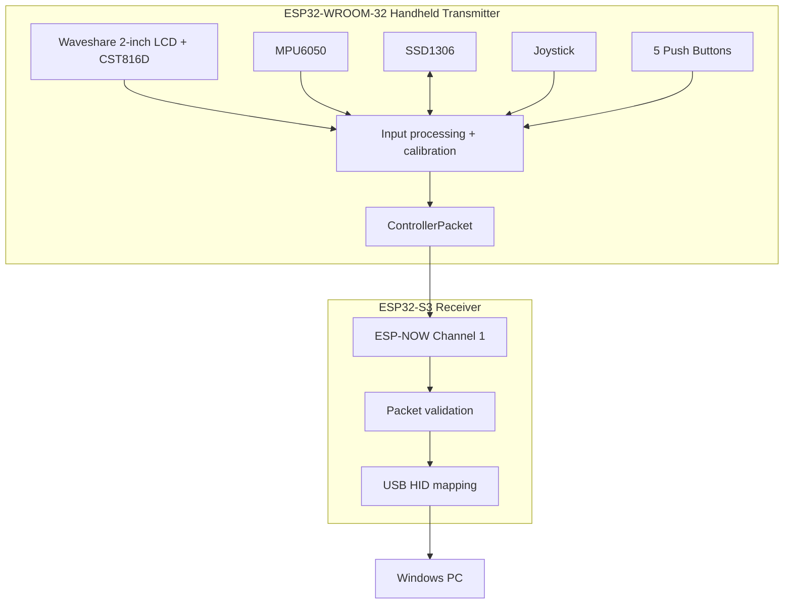

# System Architecture

## 1. Functional blocks

## 2. Transmitter responsibilities

The WROOM firmware:

- initializes the shared I2C bus at 400 kHz;
- checks the CST816D and MPU6050;
- initializes the optional SSD1306 OLED;
- initializes the Waveshare LCD and backlight;
- calibrates the joystick center;
- calibrates gyro bias;
- reads buttons and joystick;
- reads touch coordinates and gestures;
- reads accelerometer/gyro values;
- packages the values into `ControllerPacket`;
- broadcasts the packet approximately every 20 ms.

## 3. Receiver responsibilities

The intended receiver should:

- listen on the same ESP-NOW channel;
- validate packet magic/version/size;
- reject malformed or stale packets;
- map buttons/gestures/motion to USB HID actions;
- release held inputs if the wireless link is lost;
- expose the device to Windows as a mouse/keyboard HID device.

## 4. Why ESP-NOW

ESP-NOW provides direct device-to-device communication without requiring an access point. Espressif describes it as suitable for low-latency remote-control style applications.

Official documentation:
https://docs.espressif.com/projects/arduino-esp32/en/latest/api/espnow.html

## 5. Failure boundaries

| Failure | Expected containment |
|---|---|
| OLED missing | Controller continues; OLED is optional in supplied transmitter code |
| MPU6050 missing | Controller continues without IMU contribution |
| CST816D missing | Touch input unavailable; other inputs can continue |
| ESP-NOW failure | Transmitter reports failure in Serial output |
| Wireless link lost | Receiver should release held HID controls |
| USB disconnected | Receiver cannot control PC until re-enumerated |
